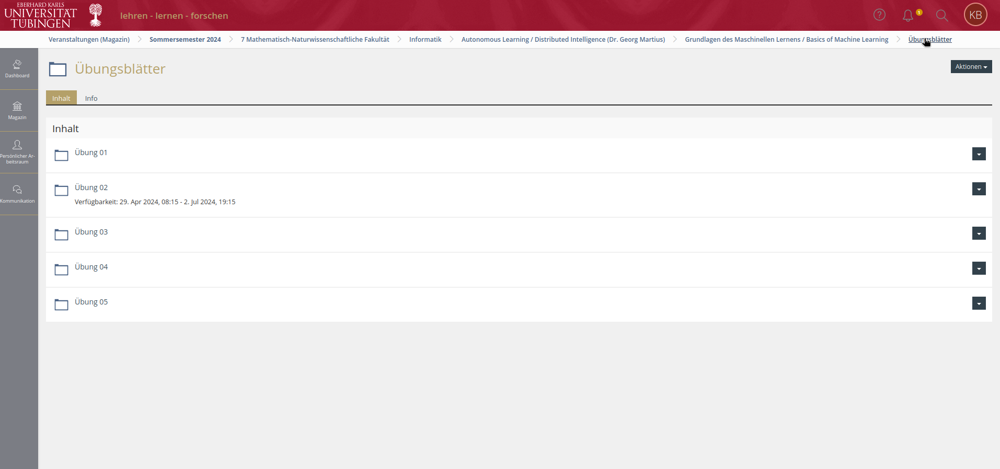

# Illias-Downloader

## Funtionality
Can automaticly download all files from a illias folder and put them in the desired folder on your machine.

## Limitations
- doesn't copy folder structure of subfolders, only extracts the files and puts them all into one folder
- only works for Illias of uni tuebingen, since other illias have different layouts
- only works if Firefox is installed

## Usage
1. install Firefox, if you dont have it installed
2. install requirements `pip install -r requirements.txt`
3. go into the `download.sh` and input your username and password, also change the download dir and url.

You can find out the download url by going to the illias folder in your browser and then in the menu, click on the folder name again, as shown on the picture below.

Then just copy the link from your browser and insert it.
